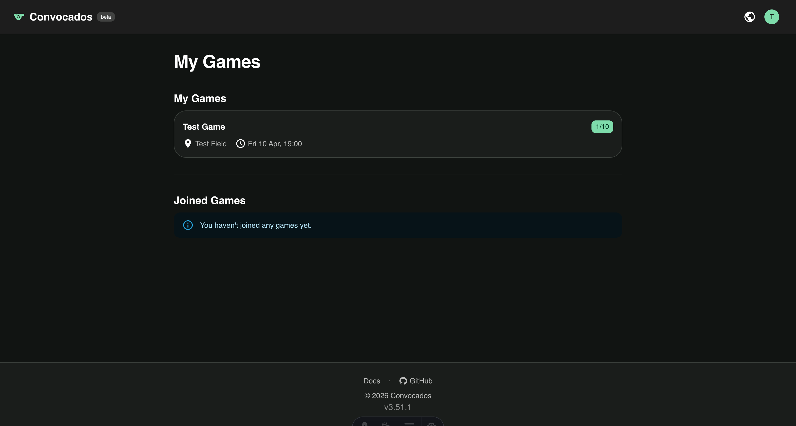
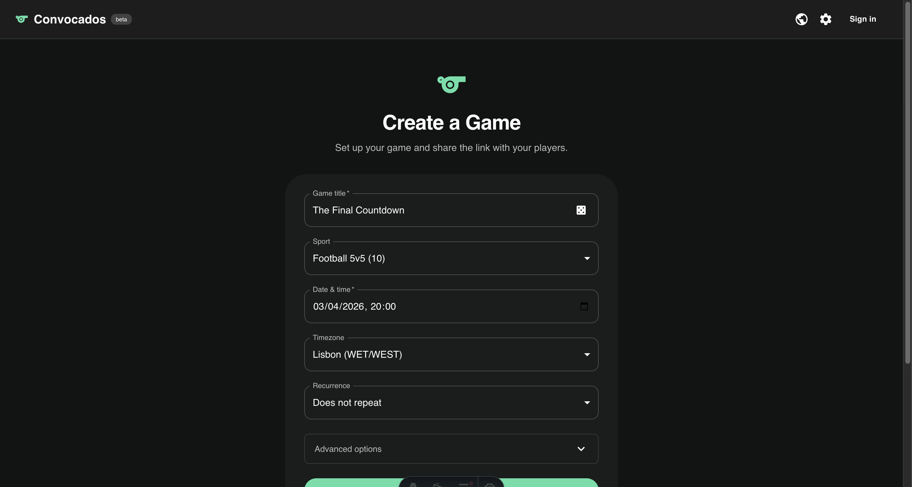
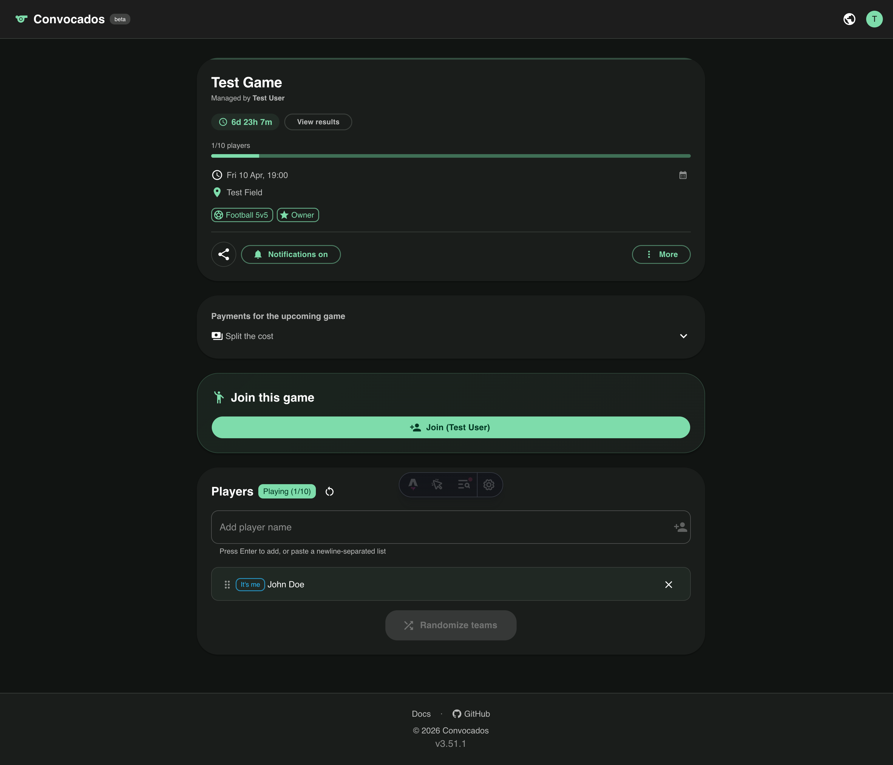
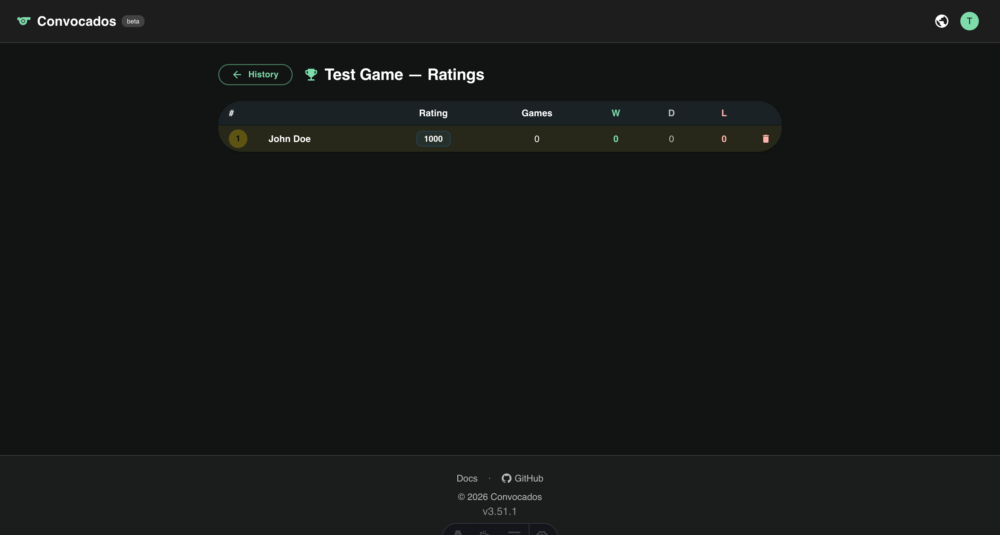
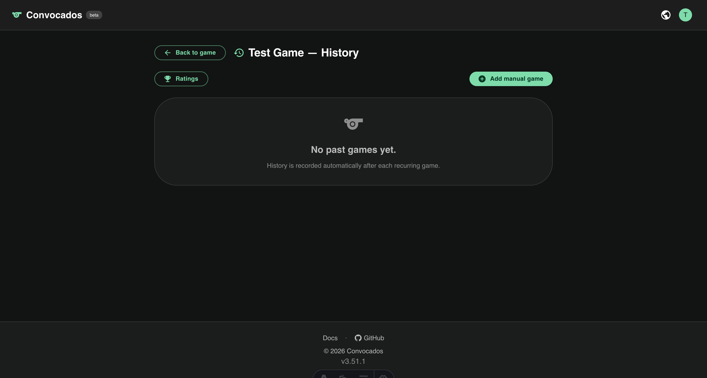
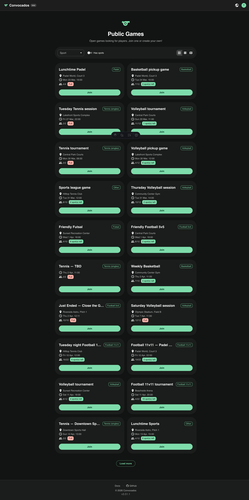
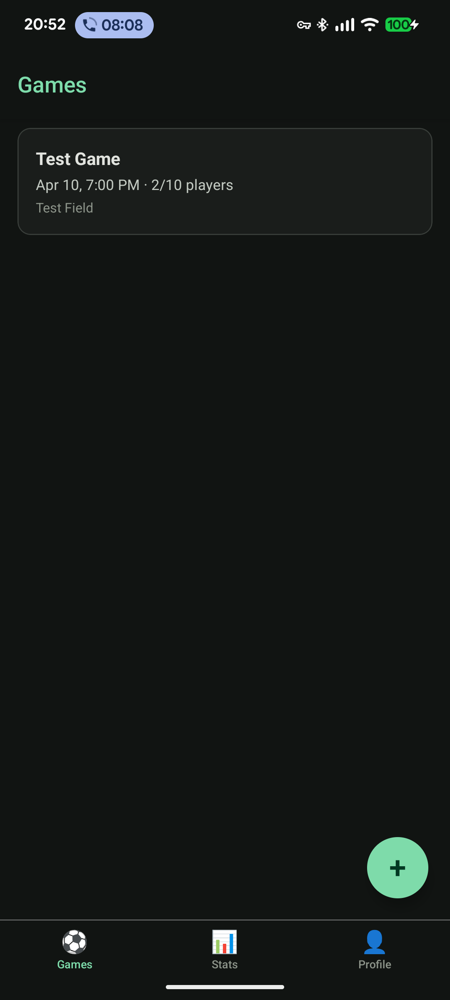
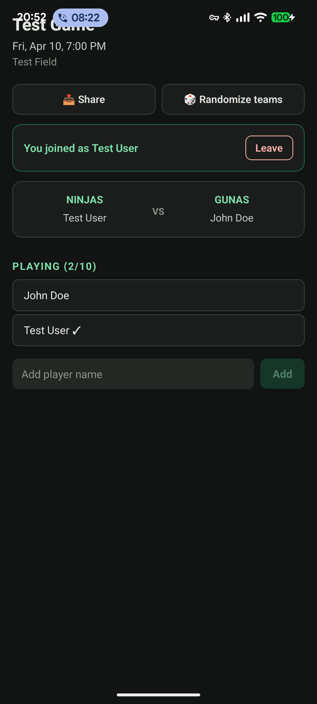
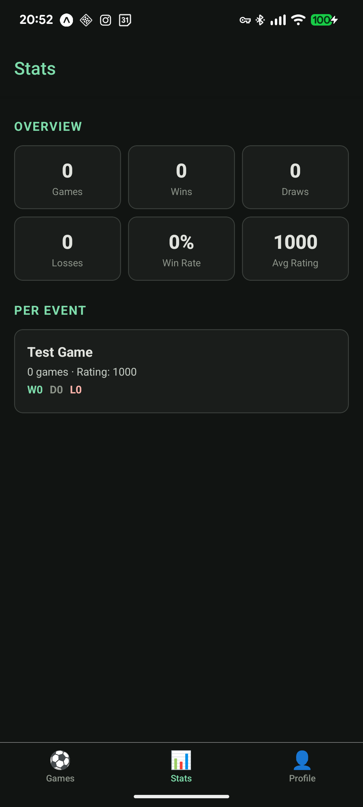
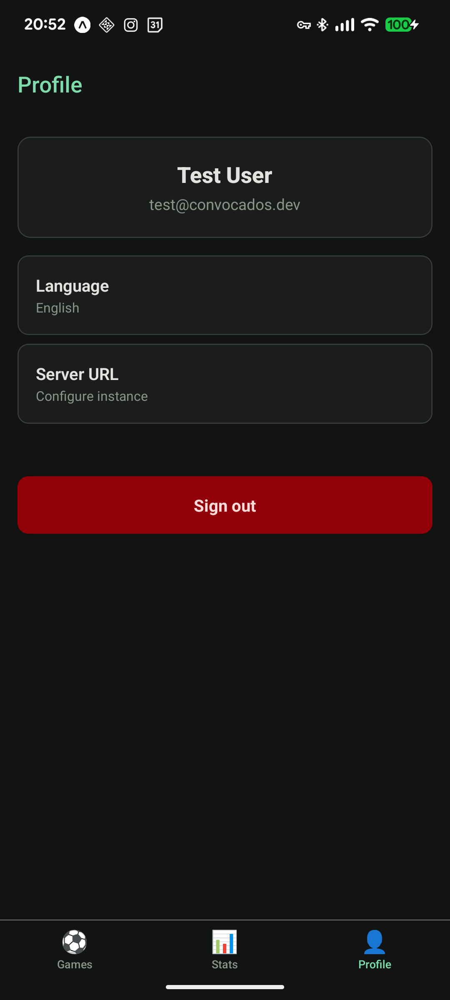

# Convocados

Web app for organizing pickup sports games — manage events, randomize teams, track scores, and notify players.



## Features

- Create and share game events via link
- Multiple sport presets (football, futsal, basketball, volleyball, tennis, padel, and more)
- Player sign-up with automatic bench when full
- Random team generation (with optional ELO-balanced mode)
- Recurring events (weekly/monthly)
- Game history with editable scores
- Public events page with filters and map view
- Push notifications (Web Push + mobile)
- OAuth 2.1 / OIDC provider with PKCE, magic link, and Google SSO
- Webhook integrations
- Full REST API
- Android mobile app (native Kotlin/Compose)

## Screenshots

### Web

| Landing | Dashboard | Event detail |
|---------|-----------|--------------|
|  |  |  |

| Rankings | History | Public games |
|----------|---------|--------------|
|  |  |  |

### Mobile (Android)

| Games | Event detail | Stats | Profile |
|-------|-------------|-------|---------|
|  |  |  |  |

## Tech stack

| Layer      | Technology                    |
|------------|-------------------------------|
| Framework  | Astro 6 (SSR, Node adapter)  |
| UI         | React 19 + MUI 6             |
| Auth       | better-auth (OAuth 2.1 / OIDC) |
| Database   | SQLite via Prisma 6           |
| Testing    | Vitest + Supertest            |
| Mobile     | Native Android (Kotlin + Jetpack Compose) |
| Deployment | Docker on Fly.io              |

## Quick start

```bash
git clone https://github.com/Cabeda/Convocados.git
cd Convocados
npm ci
npx prisma generate
npx prisma db push
npm run dev
```

The dev server starts at `http://localhost:4321`.

## Scripts

| Command              | Description                  |
|----------------------|------------------------------|
| `npm run dev`        | Start dev server             |
| `npm run build`      | Production build             |
| `npm run test`       | Run tests (Vitest)           |
| `npm run typecheck`  | TypeScript type checking     |
| `npm run db:migrate` | Create & apply DB migrations |
| `npm run db:studio`  | Open Prisma Studio           |

## Documentation

Full documentation is available at [`/docs`](https://convocados.fly.dev/docs) when the app is running, covering:

- Getting started & tutorial
- Feature guides
- Complete API reference
- Self-hosting & deployment
- Contributing guidelines

## License

MIT
