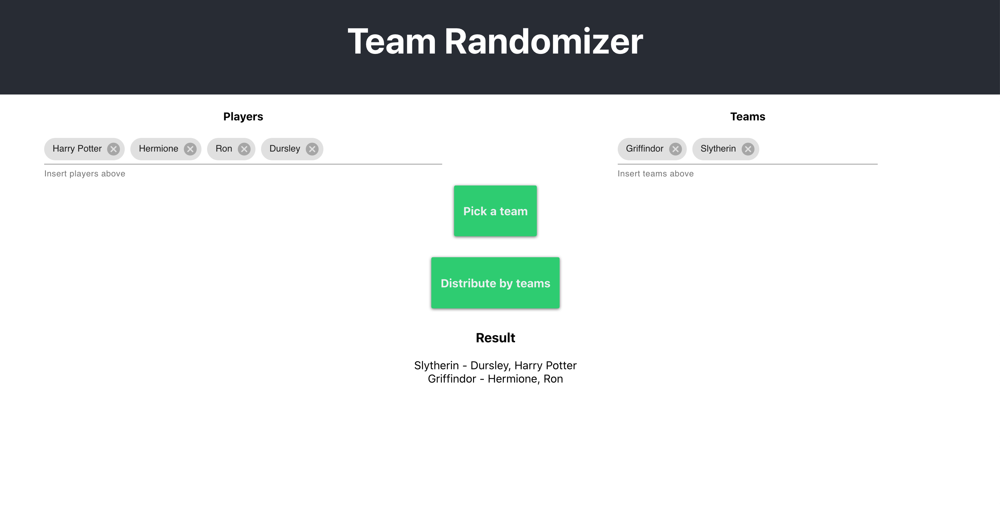

# Convocados

Web app for organizing pickup football games — manage events, randomize teams, track scores, and notify players.



## Features

- Create and share game events via link
- Player sign-up with automatic bench when full
- Random team generation
- Recurring events (weekly/monthly)
- Game history with editable scores
- Push notifications (Web Push)
- Webhook integrations
- Full REST API

## Tech stack

| Layer      | Technology                    |
|------------|-------------------------------|
| Framework  | Astro 5 (SSR, Node adapter)  |
| UI         | React 19 + MUI 6             |
| Database   | SQLite via Prisma 6           |
| Testing    | Vitest + Supertest            |
| Deployment | Docker on Fly.io              |

## Quick start

```bash
git clone https://github.com/Cabeda/Convocados.git
cd Convocados
npm ci
npx prisma generate
npx prisma db push
npm run dev
```

The dev server starts at `http://localhost:4321`.

## Scripts

| Command              | Description                  |
|----------------------|------------------------------|
| `npm run dev`        | Start dev server             |
| `npm run build`      | Production build             |
| `npm run test`       | Run tests (Vitest)           |
| `npm run typecheck`  | TypeScript type checking     |
| `npm run db:migrate` | Create & apply DB migrations |
| `npm run db:studio`  | Open Prisma Studio           |

## Documentation

Full documentation is available at [`/docs`](https://convocados.fly.dev/docs) when the app is running, covering:

- Getting started & tutorial
- Feature guides
- Complete API reference
- Self-hosting & deployment
- Contributing guidelines

## License

MIT
