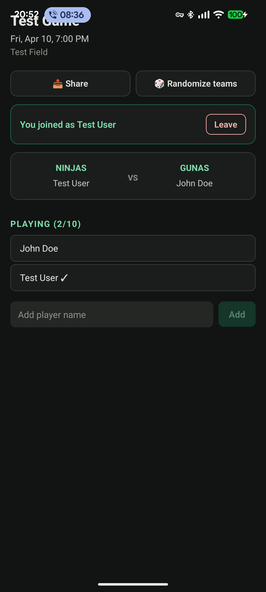

# Mobile App

Convocados has an Android app built with Expo (React Native). It connects to any self-hosted Convocados instance via OAuth 2.1 + PKCE.

## Screenshots

| Games | Event detail | Players | Stats | Profile |
|-------|-------------|---------|-------|---------|
|  |  |  |  |  |

## Features

- View and manage your upcoming games
- Join/leave events, add guest players
- Team randomization with VS display
- Player stats and ELO rankings
- Push notifications (requires development build — see below)
- Multi-language: English, Português, Español, Français, Deutsch, Italiano
- Configurable server URL — connect to any Convocados instance

## Authentication

The app authenticates via the Convocados OIDC provider using Authorization Code + PKCE. No password is stored on the device — tokens are kept in `expo-secure-store`.

The server must have the app's redirect URI registered as a trusted client:

```bash
TRUSTED_OAUTH_CLIENT_ID=convocados-android
TRUSTED_OAUTH_CLIENT_SECRET=<secret>
TRUSTED_OAUTH_REDIRECT_URIS=convocados://callback
```

## Development setup

```bash
cd mobile
npm ci
npm start          # starts Expo dev server
npm run android    # opens on connected device / emulator
```

The app points to `http://10.0.2.2:4321` (Android emulator localhost) by default. Change it in Profile → Server URL.

## Push notifications

Remote push notifications require a **development build** — they do not work in Expo Go since SDK 53.

### Build a development client

```bash
# Using EAS (recommended)
eas build --profile development --platform android

# Or build locally (requires Android SDK)
expo run:android
```

### Required setup

1. Create a Firebase project and download `google-services.json`
2. Place it at `mobile/google-services.json`
3. The `expo-notifications` plugin in `app.json` handles the rest

### EAS project ID

Update `extra.eas.projectId` in `mobile/app.json` with your EAS project ID:

```bash
eas init
```

## Project structure

```
mobile/
├── app/
│   ├── (tabs)/         # Bottom tab screens (Games, Stats, Profile)
│   ├── event/[id]/     # Event detail and sub-screens
│   ├── create.tsx      # Create event screen
│   └── index.tsx       # Auth gate → redirect to tabs
├── src/
│   ├── auth/           # OAuth + token storage
│   ├── hooks/          # useAuth, useT, etc.
│   ├── screens/        # LoginScreen
│   └── lib/            # Theme, i18n, API client
├── e2e/                # Maestro E2E tests
└── app.json            # Expo config
```

## E2E tests

Tests use [Maestro](https://maestro.mobile.dev). Run against a connected device or emulator:

```bash
maestro test mobile/e2e/
```

Requires a running dev server and a seeded test account.
